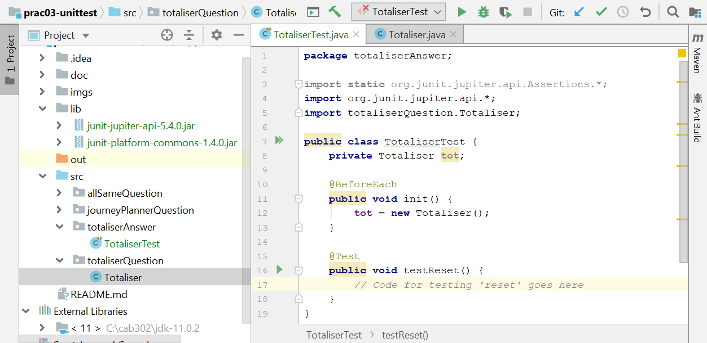
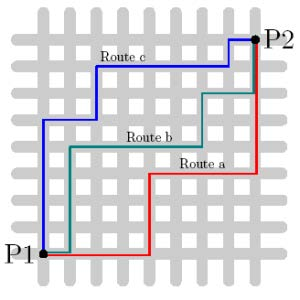

This week's practical exercises aim to get you familiar with using exceptions, and designing and implementing automated unit tests using JUnit and IntelliJ.
# Exceptions

This exercise illustrates a use case for exceptions and gives you experience in raising and handling exceptions.

The below `BankAccount` class has been implemented correctly, but it requires some exception handling. A JUnit unit test class called `TestBankAccount` has been provided for your convenience.

You will find the following code in the `BankAccount.java` file under the `bank` package:

```java
package bank;

public class BankAccount {
    private int funds;

    /**
     * Deposits an amount into this bank account.
     *
     * @param amount
     */
    public void deposit(int amount) {
        this.funds += amount;
    }

    /**
     * Getter method for funds.
     *
     * @return current funds.
     */
    public int getFunds() {
        return this.funds;
    }

    /**
     * Withdraws an amount from this bank account.
     *
     * @param amount
     * @throws FundsException if there are insufficient funds for the withdraw.
     */
    public void withdraw(int amount) {
        System.out.printf("Attempting withdraw... ");
        this.funds -= amount;
        System.out.printf("Withdrew %d funds.\n", amount);
    }

    /**
     * Transfers an amount from one bank account to another.
     *
     * @param b1 The bank account the funds are transferred from.
     * @param b2 The bank account the funds are transferred to.
     * @param amount The amount to be transferred.
     * @throws TransferException if the withdraw fails.
     */
    public static void transfer(BankAccount b1, BankAccount b2, int amount) {
        System.out.printf("Attempting transfer... ");
        b1.withdraw(amount);
        b2.deposit(amount);
        System.out.printf("Transferred %d funds from b1 to b2. Account b1 has %d funds. Account b2 has %d funds.\n", amount, b1.getFunds(), b2.getFunds());
    }
}
```

Add some exception handling to this class:

- In the withdraw method first check if there are sufficient funds to be withdrawn (the account is not allowed to overdraft). If there are insufficient funds then throw a `FundsException` with the message: `String.format("Withdraw failed. This account has %d in funds but %d were requested.", this.funds, amount)`.
- In the transfer method handle the possibility of a `FundsException` thrown by the `withdraw` call. If a `FundsException` is caught (with identifier `e`) then simply throw a `TransferException` with the message: `String.format("Transfer failed due to underlying exception: %s", e.getMessage())`.
- In the transfer method add a `finally` block after your `catch`. Normally in `finally` blocks we include cleanup code. Represent some 'cleanup code' by just including one line in your `finally` block: `System.out.printf("Cleanup transfer.\n");`.


Now try running the `TestBankAccount` unit test class and observe what happens. Try following the control flow using the debugger. The expected terminal output is shown below.


Notice that control flow is **always** passed to the `finally` block before the method exits. This is particularly interesting in the last case where the `NullPointerException` is unhandled by the transfer method yet the `finally` block is executed prior to the exception propagation.

# Group Exercise: Test case brainstorming (Totaliser example)

This exercise will give you practice at devising black-box test cases for a simple class.

In the materials supplied for this practical session you will find API documentation for three classes, including one called `Totaliser`. (This documentation was generated from a correct version of the program.) Read the documentation for the `Totaliser` class (you will find it in the JavaDoc that is inside the `doc` folder in the repository you cloned. Open the `index.html` file in this repository in a browser; right click and choose 'Open in Browser') and then, as a group, identify a small, but sufficient, set of test cases that will exercise the `Totaliser` implementation's functionality. Your tutor will write the test cases selected on the whiteboard.

# Individual Exercise: Testing with JUnit (Totaliser example)

This exercise will give you practice at using JUnit to test a simple class.

In the materials supplied for this practical session you will find an implementation of the `Totaliser` class in the `totaliserQuestion` package. The purpose of the exercise is to test the supplied program as a black box, i.e., without looking at the source code. Instead use the API documentation above to see which methods Totaliser implements and write test cases to test them.

Create a new package called `totaliserAnswers` and inside that create a new class called `TotaliserTest`. In this class, implement the various tests identified in the previous exercise. Use Week 3's lecture as a reference for creating new test classes. Note that you will need to import totaliserQuestion.Totaliser because it is in a different package. Once you get started, your code should look something like this:



**Hint:** There are (at least) two errors in the code, one obvious and one a bit harder to detect.

When you think your tests have identified the problems with the program examine the `Totaliser.java` source code file to confirm your suspicions. Then correct the errors in the code and rerun your tests to ensure that the problems have been fixed.

# Group Exercise: Test case brainstorming (JourneyPlanner example)

This exercise will give you practice at devising black-box test cases for a complicated, stateful class.

Read the API documentation for the `JourneyPlanner` class and, as a group, identify a sufficient set of tests for it. Note that this class updates private fields and thus retains a 'memory' from one method invocation to the next, making it hard to devise test cases with good 'coverage'.



**Background:** The class calculates journey times based on 'Manhattan distances', i.e., the distance you must travel in a grid-like environment by following the grid lines only (with no diagonal steps). The name derives from the exceptionally regular layout of streets in New York city, which forces people to travel in this way. Notice in the diagram above that the journey from point P1 to P2 is of the same length, no matter which route is taken.

# Individual Exercise: Testing with JUnit (JourneyPlanner example)

This exercise will give you practice at using JUnit to test a complicated, stateful class.

In the materials supplied for this practical session you will find two different implementations of the `JourneyPlanner` class in the `journeyPlannerQuestion` package: `JourneyPlannerA.java` and `JourneyPlannerB.java` - ***again, do not look at the code for these yet***.  Develop a test class `JourneyPlannerTests.java` using the test cases identified in the previous exercise, your challenge is to identify which, if any, of these implementations is correct, and what the problems are in the incorrect class or classes. Look at the code only when you have completed the tests, in order to confirm your findings.

**Hint:** In the two implementations there are (at least) two distinct errors in total.
